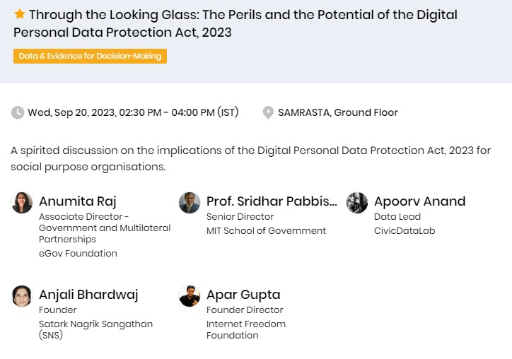
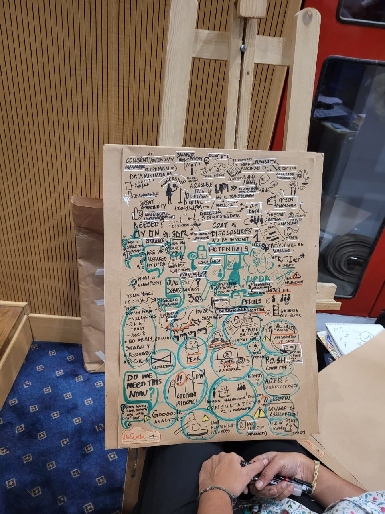

I was part of a panel discussion on the implications of the **Digital Personal Data Protection Act, 2023 (DPDPA) for Social Purpose Organisations (SPO's)**. This session was organised as part of [Dialogues on Development Management (DoDM)](https://dodm.isdm.org.in/) event by the [Indian School of Development Management](https://www.isdm.org.in/) on September 20th, 2023 in New Delhi. I was sharing the stage with [Anjali Bhardwaj](https://twitter.com/AnjaliB_) (NCPRI, [SNS](https://www.snsindia.org/about/)), [Apar Gupta](https://in.linkedin.com/in/apar1984) (Founder Director at Internet Freedom Foundation) and [Sridhar Pabbisetty](https://mitwpu.edu.in/faculty/sridhar-pabbisetty-) (MIT School of Government) and the discussion was moderated by Anumita Raj (eGov Foundation). Here are the notes from our discussion. 

The first question for us was to discuss whether SPO's are prepared for this act or not ? The answer was a unanimous "No, the organisations are not ready yet". A few key points highlighted here were: 

**Compliance will be a resource intensive process** -  Being compliant to DPDPA will require organisations to allocate a lot of resources. It's getting harder for organisations to get certify under the Foreign Contribution Regulation Act (FCRA) which facilitates acceptance and utilization of foreign contribution. This will further delay the SPOs in being compliant under this act. 

**Government Control** - A few key points from the legislation were highlighted like the responsibilities of a data fiduciary, the meaning of consent and setting up of a data protection board. The act gives a lot of power and control to the board (directly controlled by the government) which might be used to restrict certain organisations access key public information which is necessary to hold governments accountable.

**The current data ecosystem** - SPOs will have to rethink their data operations and how data privacy principles like data minimization can be adopted without many disruptions in their current data collection and processing workflows. 

**Compliance will be technology centric** - SPOs will have to adapt to certain technical processes which are necessary to stay compliant. This will require them to have systems in place, which they are not used to, to deal with personal information like managing access to data and consent.

We then discussed how this legislation can impact the social sector?

There was definitely a worry that a few organisations might just cease to exist because of points mentioned above. But we also felt that it is difficult to assess the impact for the entire sector and we will have to club SPOs in certain cohorts as per their experience of dealing with digital data. Resource rich organisations will have a head start in terms of compliance. 

Since certain categories of data fiduciaries like startups, etc will be exempted from this act, it might make it easier for such entities to collect more information but restrict SPOs who collect data from citizens. This might lead to more centralisation of data and resources. 

Certain NGO's collect information from citizens to ensure that they get access to government services and schemes. In these cases, consent is not managed using digital tools but is given as part of a regular conversation. Data which is collected once is often used whenever there is an opportunity. Going forward, such ways will not work if an SPO is treated as a Data Fiduciary. At the same time, startups will be allowed to develop tools to collect and process the data they need without any restrictions. These nuances will surely impact on the SPOs working on ground. 

Another major cause of concern for a lot of SPOs is related to the amendment of the Right to Information (RTI) Act . It might have an adverse effect on SPOs which have been using RTI as a tool to collect information from the Government. SPOs believe that this amendment will now be used as a tool by authorities to restrict important public information. 

While there are a lot of concerns, this act also gives us an opportunity to collectively think about our current data privacy practices and how it might affect our work in the future. [General Data Protection Regulation (GDPR)](https://gdpr-info.eu/) did lead to creation of a [few open source, privacy focussed tools](https://github.com/erichard/awesome-gdpr). DPDPA might help further in enhancing access to certain digital commons which will benefit all. 

Other than finding ways to adapt to this act, SPOs will be required to figure out how can citizens and communities take centre stage. Data centralisation might have to take a back seat. Rather, the focus can be on empowering more communities to collect, process and use their own information through capacity building initiatives. This is an idealistic scenario but to reach there, we will need a lot more discussions and engagement from all stakeholders so we are better placed as a community to deal with this act and ensure that it works for all and not as a tool which restricts people.

How can organisations start preparing themselves for this act?

SPOs that are slightly ahead in their digital data journeys can  follow a process to think about compliance. This will involve conducting thorough assessments of internal data tools, data collection procedures and consent mechanisms. Certain new roles might have to be created within SPOs like a **data governance manager** whose primary responsibility will be to assess the data maturity, figure out data access mechanisms and data sharing protocols, etc. Having a dedicated team of people for conducting such data audits might be helpful. 

Since this process will only be relevant for a selected few SPOs, the challenge for all of us will be to enable the majority of SPOs, which lack access to skills or resources, to adapt to this law. We should work towards setting up [responsbile data communities](https://responsibledata.io/) which can anchor conversations and capacity building efforts, provide mentorship and curate resources for SPOs that are not well equipped to deal with this act. A [Light touch Support (LiTS)](https://www.theengineroom.org/light-touch-support/) initiative by the Engine room is a good example in this regard. LiTS partnerships offer lightweight, pro bono support to organisations and individuals with questions about using data or technology in their social justice work.

At the end, all panel members agreed that both **Right to Information** and **Data Privacy** are important tools for any society in this day and age. A question which we all have to grapple with is how can we strike the right balance between the two. This will be an iterative process. More open discussions and diverse participation will help us in figuring out a way forward. 

Here is a sketched summary of the session (Really good work by the creator to capture the insights)

A few good articles and other resources I found while preparing for this session.

1. [The Business End of the DPDP Act](https://exmachina.substack.com/p/the-business-end-of-the-dpdp-act)
2. [Awesome GDPR](ttps://github.com/erichard/awesome-gdpr)
3. [Protection Employees Personal Data](https://www.epw.in/journal/2023/35/commentary/protecting-employees%E2%80%99-personal-data.html)
4. [EXPLAINED - Dark Side of India's Data Protection Bill](https://www.youtube.com/watch?v=p_ERWLezCzI)
5. [Apar Gupta Explains Digital Personal Data Protection Protection Bill](https://www.youtube.com/watch?v=6xD3ZrdQxcc)
6. [Digital Data Protection Act 2023: Five Must Reads](https://www.scobserver.in/journal/digital-data-protection-act-2023-five-must-reads/)

 